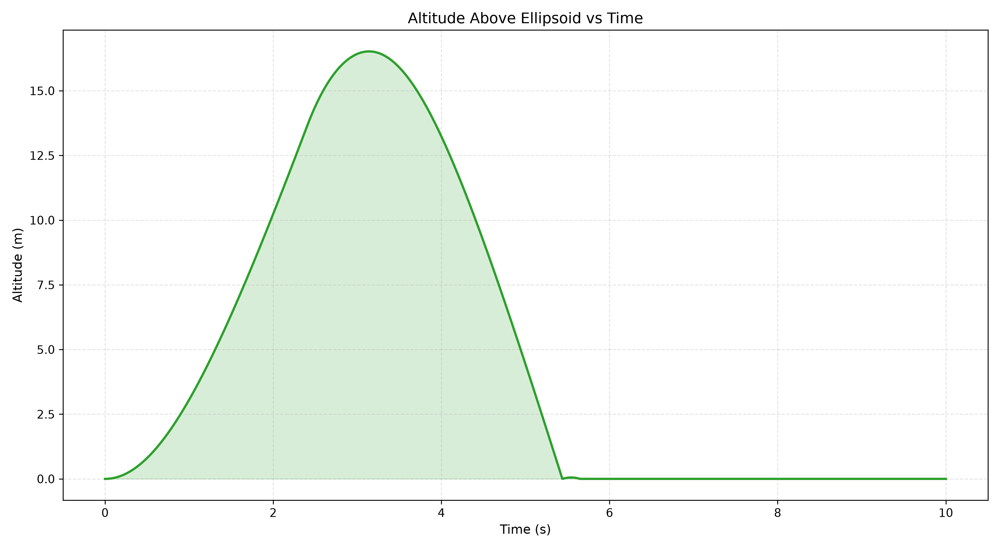
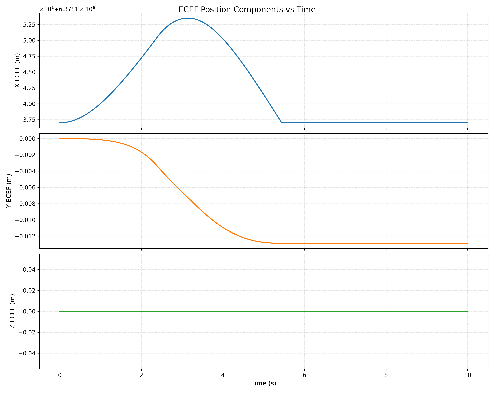
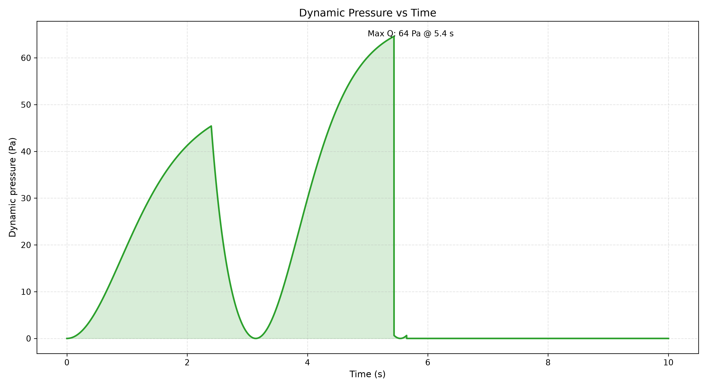
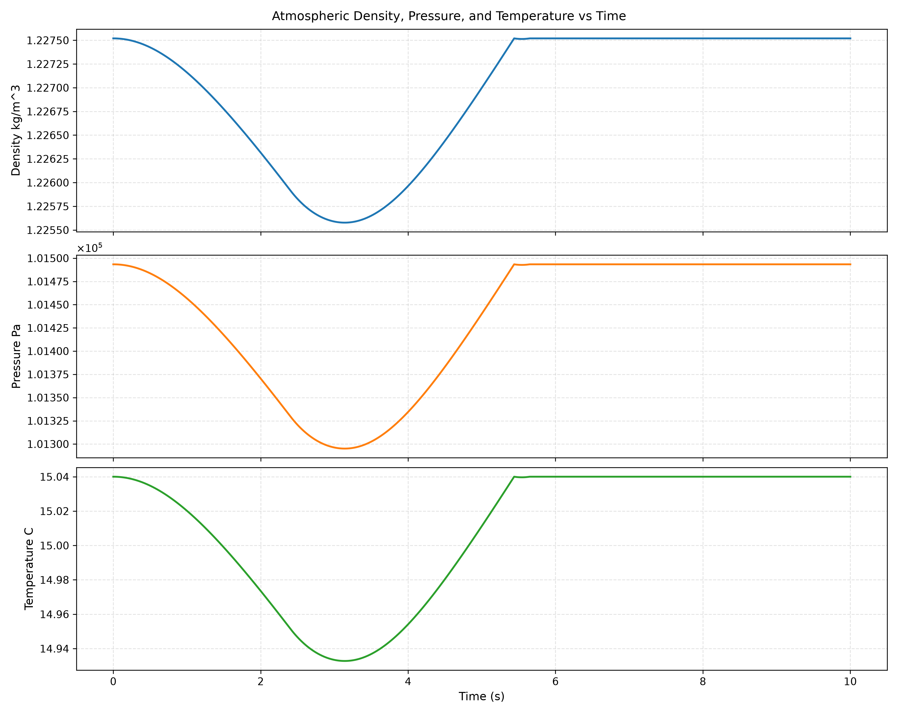
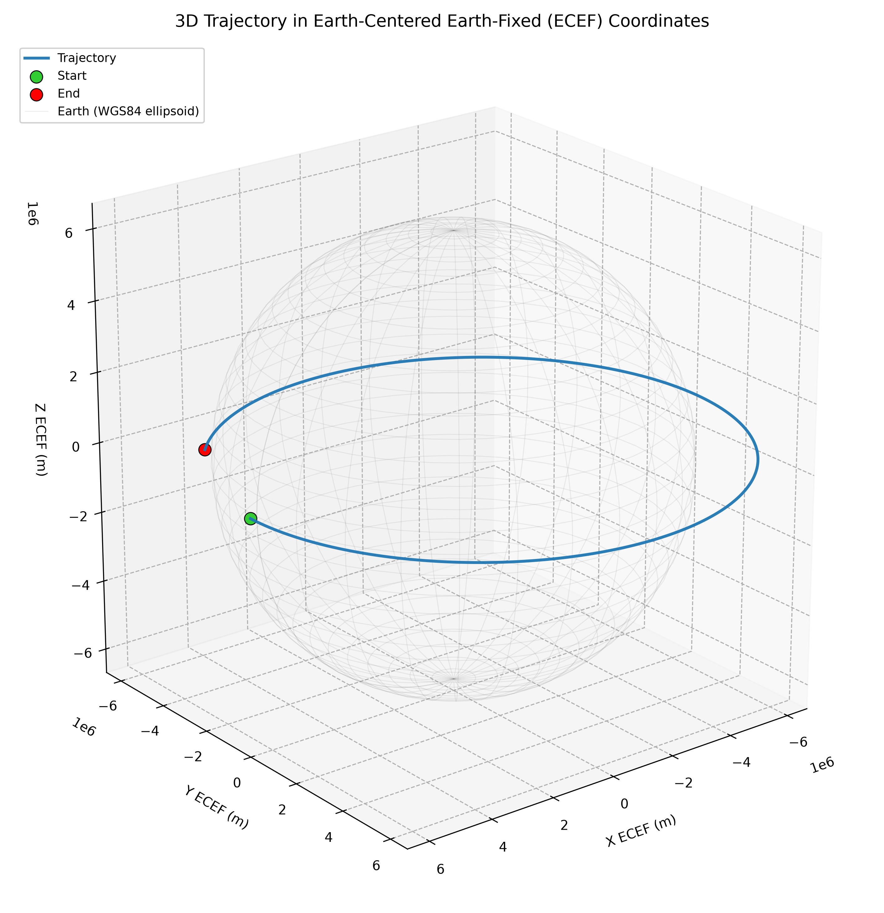
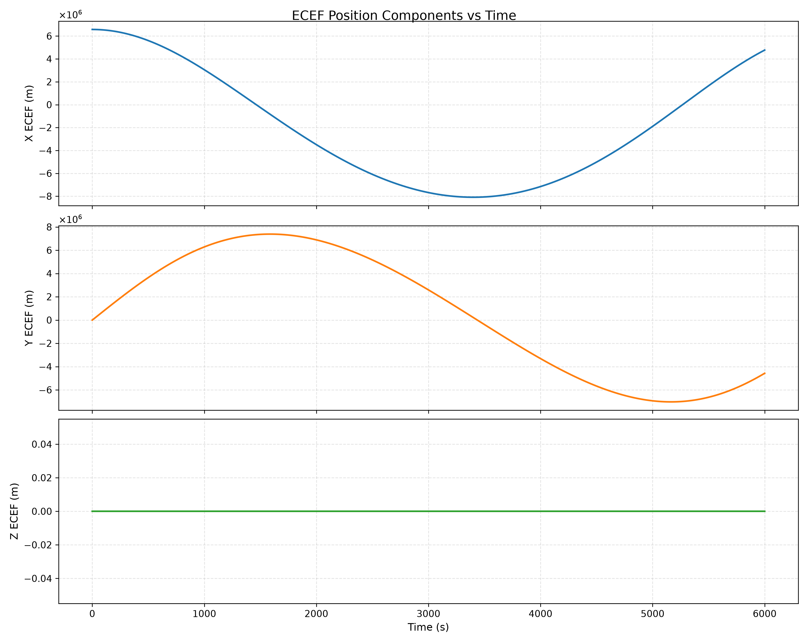

# Spacecraft Simulator

This repository is a realistic physics engine for all types of rocket vehicles launching from earth's surface. The intent of building and maintaining this project is to demonstrate/strengthen my computational abilities and to provide an in-house solution for simulation and modeling of custom rockets. Physical accuracy is of utmost importance. To support flight software development, the goal is to also provide an interface for avionics to communicate with the simulation in real-time to provide realistic analysis of behavior in-flight.

## Table of Contents
- [Example Plots](#example-plots)
- [Code Structure](#code-structure)
- [Setting Up the Environment](#setting-up-the-environment)
- [Configuring Simulation Settings](#configuring-simulation-settings)
- [Active Features List](#active-features-list)
- [Gallery](#gallery)
  - [Satellite Orbiting Earth](#satellite-orbiting-earth)

## Example Plots

Here are a couple samples from a basic simulation that I ran for a model rocket using an Estes E12-6 black powder motor launched from LLA coordinates $\langle \phi=0.00000, \lambda=0.0000, h=0.0 \rangle$:

## Code Structure

The main program and all source get compiled with the `g++-13` C++ compiler. All header files are placed at the `include/` directory and all source files are included in the `source/` directory. Unit tests are written with `googletest` (included as a submodule) and are placed in the `tests/` folder.

To remain readable and easy to maintain, I'm using a combination of functional and object-oriented programming patterns. Most physics models are stateless and are better suited to be represented by collections of functions. The main component used in the simulation is a state vector containing position, velocity, angular velocity, and attitude quaternion (13 floating points). For data structures explicitly used by physical models, I always use a `struct` to encapsulate the data. For subsystems that require their own interfaces for more complex interactions with the environment, _then_ I will prefer to use a `class` or inheritence pattern.

The philosophy for this project is to use the best-suited programming pattern and does not restrict itself to any singular form.

## Setting Up the Environment

I develop on a Macbook Pro using homebrew for package management. The compiler expects the user to have installed `g++-13`. The `configure_environment.sh` script is designed to build the environment you'll need to replicate my processes and use the tools natively.

## Configuring Simulation Settings

The settings are modifiable by directly changing the source code right now - a future improvement will allow configuration files to be dynamically loaded at runtime but that's not available just yet. For now, navigate to the `source/` folder and follow the commentary notes in `main.cpp` _and_ `settings.cpp`. Detailed instructions are laid out about where to inject your system modifications and what should be left alone.

**NOTE:** Everything is simplified in the model of a rocket right now, but there's still a lot of value in the results of the simulations. The gravitation model is EGM84 combined with an empirical formula for gravity at low altitudes which is very high fidelity for a large altitude domain on earth. The simulator also takes into account rotating-frame effects (coriolis and centrifugal forces). As a natural consequence, the atmosphere is assumed to rotate uniformly with the earth, so rotating-frame effects also impact drag force terms - that's _very_ realistic with low-wind scenarios.

Some areas that weaken the grade of fidelity right now include:

- The aerodynamic interactions
  - Missing body _and_ lift forces
  - Missing force coefficient tables that depend on angle of attack and mach number
- Thrust curve model
  - Missing non-linear curves, ignition delay, and random variability around mean behavior
- Thrust vector model
  - Missing latency-integration _and_ actuation rate limits

A comprehensive list of the items that result in "missed opportunity for accuracy" will not be provided  – the feature history, over time, will serve as a reasonable replacement.

## Active Features List

| Name | Capabilities | Status |
| ---- | ------------ | ------ |
| WGS84 Model | Conversion between LLA and ECEF coordinate systems | Implemented |
| Rotating reference frame (earth) | Adds Coriolis and Centrifugal non-inertial forces | Implemented |
| Body-frame attitude tracking | Use body-frame angular rates to integrate attitude over time with a quaternion | Implemented |
| Aerodynamic coefficients tables | Interpolate multi-dimensional datasets for aerodynamic coefficients as functions of speed and angle of attack | To-Do |
| Aerodynamic modeling | Implement aerodynamic forces over body surfaces including lift, drag, and grid fins | To-Do |
| Thrust modeling | Interpolate multi-dimensional thrust tables for custom engine types | To-Do |
| Custom thrust vector mounts | Allow user to define how actuator inputs map to unit-thrust-vectors | To-Do |
| Ethernet UDP interface for HIL | Allow communication between the simulation and avionics systems | To-Do |
| Real-time processing | Run the simulation timed against a real clock and zero-latency feedback loop with HIL | To-Do |

## Gallery

This is a small collection of other simulations that I've run to test everything so far.

### Satellite Orbiting Earth

